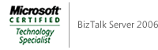

{
  "author": "Sander Schutten",
  "date": "2007-01-29T11:22:05Z",
  "description": "",
  "draft": false,
  "slug": "mcts-biztalk-server-2006",
  "title": "MCTS BizTalk Server 2006",
  "menu": {
    "sidebar": {
      "name": "MCTS BizTalk Server 2006",
      "weight": 200701,
      "identifier": "mcts-biztalk-server-2006",
      "parent": "2007/01"
    }
  }
}

Today I passed the [70-235 exam](http://www.microsoft.com/learning/exams/70-235.mspx), required for earning the [MCTS BizTalk Server 2006 certification](http://www.microsoft.com/learning/mcp/mcts/biztalk/default.mspx). About 20% of the questions was related to the Business Rule Engine (BRE) and another 15% to Business Activity Monitoring (BAM). The other questions were all general BizTalk questions, including some questions on Role Links. I found the exam a little difficult, mainly because I haven’t worked with the BRE that much and also haven’t used Role Links. Luckily I took the [BizTalk 2006 Deep Dive course](http://www.quicklearn.com/class.aspx?class=BTSDD) by [QuickLearn](http://www.quicklearn.com), which gave me the basic knowledge on these subjects.

