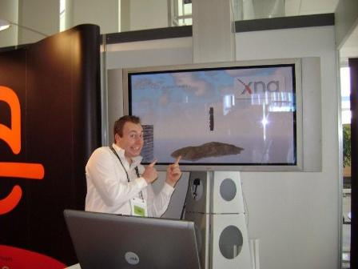

{
  "author": "Sander Schutten",
  "date": "2007-06-18T18:37:13Z",
  "description": "",
  "draft": false,
  "slug": "devdays-2007-were-you-there",
  "title": "DevDays 2007, were you there?"
}

DevDays 2007…I was there, but were you? For those of you living in the Netherlands, Microsoft held the 2007 edition of DevDays and off course Avanade was well represented. On the main plaza you could find our stand where we were running an XNA demo on two giant plasma screens. One was running on a laptop and the other live on a Xbox360. Okay, Avanade doesn’t actually do projects using XNA, but we didn’t mind. In a part of our spare time Eric van Feggelen (http://www.fegelein.com) and I developed sort of a tech demo to show off the power of XNA. Both with little experience in 3D game development (Eric some more than I) we put together a scene rendering with water, clouds, an island and off course our logo.

I’ve put the demo online for you to download. You need at least a videocard that support shader language 2.0 and DirectX9 to run this.  
 [download#2#image]

Most of the time I spend on our stand showing off our XNA demo, but I also was able to attend some sessions. Most of the DevDays were about Silverlight and Visual Studio Orca’s, and oh boy, some great stuff is ahead of us. I’m definitely going to play a little with Silverlight and LINQ to SQL, but also with XNA.

Here you can see me in action on the stand 

