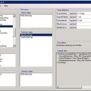

{
  "author": "Sander Schutten",
  "categories": [
    "BizTalk",
    "BizUnit",
    "Unit Test",
    "XML"
  ],
  "date": "2008-07-04T05:21:05Z",
  "description": "",
  "draft": false,
  "slug": "bizunit-designer",
  "tags": [
    "BizTalk",
    "BizUnit",
    "Unit Test",
    "XML"
  ],
  "title": "BizUnit Designer"
}

   From CodePlex:

> BizUnit Designer is a GUI that allows rapid creation of BizUnit test cases which can be used for unit testing or system testing distributed applications. The easy to use drag and drop user interface has minimal learning curve which will get you up and running with test cases in a matter of minutes.

I’ve used BizUnit on a couple of projects (even non-BizTalk projects) and I think it’s very useful. The only thing bothering me was that I always had to edit the XML files directly (although not difficult). This designer somewhat helps you with this. Unfortunately are all the test steps very different from each-other that building a generic designer can only help a little. The UI could use some tweaks to make it easier to use. Anyway I think it’s a great initiative, although not perfect.

Get it [here](http://www.codeplex.com/bud).

