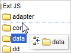

{
  "author": "Sander Schutten",
  "categories": [
    "Ajax",
    "DHTML",
    "Ext JS",
    "Javascript"
  ],
  "date": "2008-07-01T13:04:01Z",
  "description": "",
  "draft": false,
  "slug": "ext-js",
  "tags": [
    "Ajax",
    "DHTML",
    "Ext JS",
    "Javascript"
  ],
  "title": "Ext JS"
}

Although I rarely develop front-end applications, let alone web applications, during my day-to-day job, I’m still practicing the skill in my personal time. Before my interests in application integration started to arise I was very much intrigued by all what is currently known as web 2.0 and Ajax. In the time we would simply call it DHTML, but that term was superseded by the more catchy ones.

So if I see someting passing by that really looks cool and is built using simply Javascript and HTML I always take a quick look at it. This time I was following an e-mail thread on Ajax libraries until Ext JS was suggested. As I’d never heard of it, I went out and looked at the samples. And I must say I’m really impressed with the style, smoothness and functionality of the library. Now I only have to check out how to incorporate this with .Net.

Please do check out the samples at [http://extjs.com/deploy/dev/examples/samples.html](http://extjs.com/deploy/dev/examples/samples.html).

