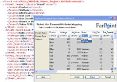

{
  "author": "Sander Schutten",
  "categories": [
    "BizTalk",
    "Excel",
    "Pipeline",
    "Spread",
    "XML"
  ],
  "date": "2008-07-02T08:41:57Z",
  "description": "",
  "draft": false,
  "slug": "farpoint-spread-for-biztalk-server-2006",
  "tags": [
    "BizTalk",
    "Excel",
    "Pipeline",
    "Spread",
    "XML"
  ],
  "title": "FarPoint Spread for BizTalk Server 2006"
}

If you’ve ever wanted or needed to parse Excel files using BizTalk, you can now. Some time ago FarPoint released a pipeline dissassembler component for BizTalk Server 2006 which is able to convert Excel files into XML. From their website:

> Spread for BizTalk Server 2006 provides a complete solution for integrating Microsoft Excel data seamlessly into your BizTalk applications.
> 
> Spread includes a pipeline disassembler that parses Excel data (XLS, Excel 2007 XML, CSV, TXT) into XML, and a pipeline assembler that creates Excel (XLS, Excel 2007 XML) and PDF documents from XML data in BizTalk Applications.

Read more about Spread, download a trial or obtain a license [here](http://www.fpoint.com/biztalk/default.aspx).

