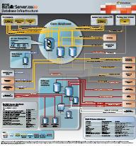

{
  "author": "Sander Schutten",
  "categories": [
    "BizTalk",
    "Poster"
  ],
  "date": "2008-07-02T12:42:37Z",
  "description": "",
  "draft": false,
  "slug": "more-biztalk-posters",
  "tags": [
    "BizTalk",
    "Poster"
  ],
  "title": "More BizTalk posters"
}

Somebody at the product team has really started a rush to push out these nice looking posters. Here is a rather new one:

**BizTalk Server 2006 R2 Database Infrastructure Poster**  
[http://www.microsoft.com/downloads/details.aspx?familyid=24662FB5-622C-4E7E-9E83-505D1F664C4D&displaylang=en](/wp-admin/redir.aspx?C=11b067ed78e3448c9f3e4bfc19afceb5&URL=http%3a%2f%2fwww.microsoft.com%2fdownloads%2fdetails.aspx%3ffamilyid%3d24662FB5-622C-4E7E-9E83-505D1F664C4D%26displaylang%3den)

And as a service to those of you that haven’t seen anyone of these:

**BizTalk Server 2006 R2 Runtime Architecture Poster**  
[http://www.microsoft.com/downloads/details.aspx?familyid=8790E652-1DA5-4E80-88FE-B87606233DB4&displaylang=en](/wp-admin/redir.aspx?C=11b067ed78e3448c9f3e4bfc19afceb5&URL=http%3a%2f%2fwww.microsoft.com%2fdownloads%2fdetails.aspx%3ffamilyid%3d8790E652-1DA5-4E80-88FE-B87606233DB4%26displaylang%3den)

**BizTalk Server 2006 R2 Capabilities Poster**  
[http://www.microsoft.com/downloads/details.aspx?familyid=34F41573-C552-466F-B531-32CB09A57CDD&displaylang=en](/wp-admin/redir.aspx?C=11b067ed78e3448c9f3e4bfc19afceb5&URL=http%3a%2f%2fwww.microsoft.com%2fdownloads%2fdetails.aspx%3ffamilyid%3d34F41573-C552-466F-B531-32CB09A57CDD%26displaylang%3den)

**BizTalk Server 2006 R2 Scale-Out Configurations Poster**  
[http://www.microsoft.com/downloads/details.aspx?FamilyID=FF468298-64BE-4947-A086-F61584CAF995&displaylang=en](/wp-admin/redir.aspx?C=11b067ed78e3448c9f3e4bfc19afceb5&URL=http%3a%2f%2fwww.microsoft.com%2fdownloads%2fdetails.aspx%3fFamilyID%3dFF468298-64BE-4947-A086-F61584CAF995%26displaylang%3den)

