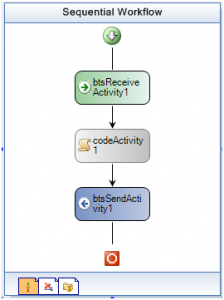

{
  "author": "Sander Schutten",
  "categories": [
    "BizTalk",
    "Extensions",
    "WF",
    "Workflow"
  ],
  "date": "2008-07-02T11:26:58Z",
  "description": "",
  "draft": false,
  "slug": "released-biztalk-server-2006-extentions-for-wf",
  "tags": [
    "BizTalk",
    "Extensions",
    "WF",
    "Workflow"
  ],
  "title": "Released: BizTalk Server 2006 extentions for WF"
}

Just released (oh well, a couple of months ago), the long awaited BizTalk Server 2006 extensions for Windows Workflow Foundation SDK. Use WF modeling and host workflows in BizTalk Server. Note the BTS messaging activities in the image.

The new BizTalk Server edition will most likely sport the Workflow Designer instead of the plain old Orchestration Designer. This probably results into something that looks a lot like what you get with the extentions. With the extentions you won’t have to choose between either product at the start of a project, but you could use both instead.

Note that this release is not supported by Microsoft customer services and should be treated as an SDK sample. If you still want to use this on a project or just want to play with it, you can download it [here](http://www.microsoft.com/downloads/details.aspx?FamilyID=b701c00f-cdc1-4edb-a975-b9412263ec6e&displaylang=en).

 

 

