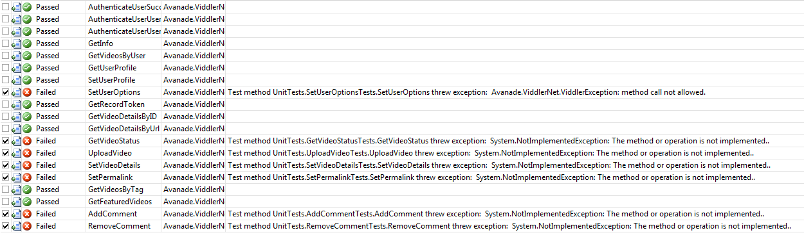

{
  "author": "Sander Schutten",
  "categories": [
    ".NET",
    "API",
    "C#",
    "Viddler"
  ],
  "date": "2008-08-20T18:13:11Z",
  "description": "",
  "draft": false,
  "slug": "first-release-of-viddlernet",
  "tags": [
    ".NET",
    "API",
    "C#",
    "Viddler"
  ],
  "title": "First release of Viddler.Net"
}

If you read my article in the Dutch .Net Magazine about Vista Media Center add-ins and you came looking on my blog for the Viddler.Net api, you just found it! If you don’t know what I’m talking about, please read on 

This is my first release of the Viddler.Net api, which is a wrapper for the [Viddler api](http://wiki.developers.viddler.com/index.php/Viddler_API). The Viddler.Net api allows a .Net developer to make use of the videos on the [Viddler website ](http://www.viddler.com)through code. At this stage not all methods are implemented, but they will be soon. In the download you’ll find the full source code of the api including the unit tests. To be able to run the unit tests you need to modify the app.config and put in your own username, password and api key. You can request you api key [here](http://wiki.developers.viddler.com/index.php/API_KEY).

If you want to use Viddler.Net in your own project, you need to add a Viddler.Net configuration section to your app.config or web.config. To do this you first need to declare the configuration section in the <configSections> section in top of the configuration file. Then you need to define the configuration section somewhere below the configSections section, but between the <configuration>elements. You configuration file should look something like this:

<configuration><configsections><section name="viddlerNetSettings" type="Avanade.ViddlerNet.Settings, Avanade.ViddlerNet, Version=1.0.0.0, Culture=neutral, PublicKeyToken=null"></section></configsections><viddlernetsettings apikey="yourApiKeyHere" baseurl="http://www.viddler.com/rest/v1/?method={0}&api_key={1}"></viddlernetsettings></configuration>

[download#4#image] 

Note that not all methods are currently implemented or working correctly. I’m working on getting them all to work, but I thought to release a version now, while I’m still improving it. The current status is represented by the following test results overview (click to enlarge):

On my todo-list is currently:

- 
Implement all methods

- 
Complete all unit tests

- 
Change http method from GET to POST to allow more characters for some parameters

