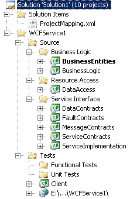

{
  "author": "Sander Schutten",
  "date": "2008-10-15T07:53:13Z",
  "description": "",
  "draft": false,
  "slug": "better-wssf-solution-structure",
  "title": "Better WSSF solution structure"
}

I’ve done my share of work with the Web Service Software Factory modelling edition, but never have I liked the solution structure it generates for me. Or either the namespaces of the projects are wrong, or the paths became too long because of the fully qualified names I’d use. This time I reserved some time to tackle this once and for all. The result is an easy to apply patch for WSSF: Modelling Edition.

What does it do:

- Does not add the service name to each project but name them simply BusinessEntities, ServiceImplementation or DataContracts
- Let the user choose his own namespace, which is then added to each project name. E.g. a user chooses the namespace MyCompany.MyProduct. The BusinessEntities project then gets the namespace MyCompany.MyProduct.BusinessEntities.
- Names the host application after the service instead of just ‘Host’

What doesn’t it do:

- It doesn’t change the assembly name. There seems to be a bug in the templating system of Visual Studio so the AssemblyName property of a template project is always set to the project name. I haven’t tested this with Visual Studio 2008 SP1, so I’m interested to know if that service pack solves this.
- It currently doesn’t work for ASMX implementation project, only for WCF implementation projects. I don’t think ASMX is done with WSSF that much these days, so I didn’t bother to implement it for ASMX.

How to apply the patch:

- Download the zip file containing the patched files from the bottom of this post.
- Extract the contents of the zip file to the “**C:Program FilesMicrosoft Service Factory Feb 2008Guidance Package**” directory (or other directory where you installed WSSF), replacing the existing files. Create a backup if you want to revert to the existing templates and recipes.

How to use the patch:

- Choose to generate the WCF implementation projects like you normally do. This means right clicking on the solution and choosing **Add > WCF Implementation Projects**.
- Enter the desired name for the service. A simple name will do, do not enter a fully qualified name here becuase you can choose a namespace in the next step. [Screenshot](images/wssfservicename.gif)
- In the next screen you supply a desired namespace. Remember that the namespace you enter here will be added to every project that is generated. [Screenshot](images/wssfservicenamespace.gif)

[download#5#image]

