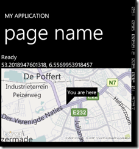
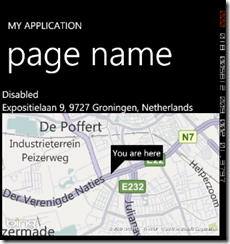

{
  "author": "Sander Schutten",
  "categories": [
    "Bing",
    "geolocate",
    "location",
    "wp7"
  ],
  "date": "2010-12-06T15:41:25Z",
  "description": "",
  "draft": false,
  "slug": "building-a-location-aware-windows-phone-7-application-2",
  "tags": [
    "Bing",
    "geolocate",
    "location",
    "wp7"
  ],
  "title": "Building a location aware Windows Phone 7 application",
  "menu": {
    "sidebar": {
      "name": "Building a location aware Windows Phone 7 application",
      "weight": 201012,
      "identifier": "building-a-location-aware-windows-phone-7-application-2",
      "parent": "2010/12"
    }
  }
}

The Windows Phone 7 SDK contains a couple of APIs for interacting with different parts of the phone hardware, like accessing the camera or initiating a phone call. One of the cool APIs of Windows Phone 7 is the Location API. Just as in the desktop version of .NET Framework 4.0, the Location API enables you to get the approximate location of the user. To find the location of the user, the API uses GPS, WiFi or cell tower triangulation, where the first is the most and the latter least accurate. The API hides the method of determining the location for you as a developer and will attempt to use the most accurate available method. By default it uses cell tower triangulation, but if you tell it you need high accuracy it will try WiFi or GPS when available. For you as a developer you need to carefully determine the level of accuracy, since the more accurate method the slower and more power consuming it gets.

In this example I’ll show you how to use the Location API. First off I created a new Windows Phone application using the ‘Windows Phone Databound Application’ project template. You can use any of the project templates, but I chose this one because I like to use MVVM all the time. The next thing I do is changing the UI. Because I use the Bing maps control, make sure you reference the Microsoft.Phone.Controls.Maps.dll assembly. Also add a reference to the namespace to the MainPage.xaml, like this:

xmlns:maps="clr-namespace:Microsoft.Phone.Controls.Maps;assembly=Microsoft.Phone.Controls.Maps"

We will use a TextBlock to show the current estimated address and a Maps control to show your current estimated location on a map. Replace the complete contents of the ContentPanel Grid with the following XAML snippet. You may need to remove some code from the codebehind of MainPage.xaml because it references the ListBox we remove.

 <StackPanel> <TextBlock Text="{Binding Status}" /> <TextBlock Text="{Binding Address}" /> <maps:Map Center="{Binding Location, Mode=TwoWay}" ZoomLevel="13"> <maps:Map.CredentialsProvider> <maps:ApplicationIdCredentialsProvider ApplicationId="<YourKeyHere>"/> </maps:Map.CredentialsProvider> <maps:Pushpin Content="You are here" Location="{Binding Location}" /> </maps:Map> </StackPanel>

In order to use the Bing maps control, you need your own key. Request a key on the [Bing maps portal](http://www.bingmapsportal.com/).

In the XAML I’ve used bindings to Status, Address and Location properties. These properties do not yet exist, so the next thing is to add these properties to the MainViewModel class in MainViewModel.cs. The Status property is of type GeoPositionStatus and contains the status of the GeoCoordinateWatcher, the Address property is a string containing the current estimated address and the Location property is of type GeoCoordinate, which is a type used to represent a lat/long position. The following code snippet shows you the three properties to be added to the view model:

private GeoPositionStatus _status; /// 
 /// Contains the status of the GeoCoordinateWatcher to see if it is initializing, ready or not getting any data. /// 
 /// <returns></returns> public GeoPositionStatus Status { get { return _status; } set { if (value != _status) { _status = value; NotifyPropertyChanged("Status"); } } } private string _address; /// 
 /// Contains the current estimated address as returned by the reverse geolocation web service. /// 
 /// <returns></returns> public string Address { get { return _address; } set { if (value != _address) { _address = value; NotifyPropertyChanged("Address"); } } } private GeoCoordinate _location; /// 
 /// Contains the current estimated lat/long location as returned by the GeoCoordinateWatcher. /// 
 /// <returns></returns> public GeoCoordinate Location { get { return _location; } set { if (value != _location) { _location = value; NotifyPropertyChanged("Location"); } } }

Now that we’ve set up our UI and bindings, it’s time to start using the Location API. The Location API consists of two classes: GeoCoordinateWatcher and CivicAddressResolver, just like in the desktop framework. The GeoCoordinateWatcher does the heavy lifting of calculating the approximate lat/long of the phone, while the CivicAddressResolver translates the lat/long to a human readable address using reverse geolocation. Unlike the desktop version of the .NET Framework, the CivicAddressResolver isn’t implemented on the phone. Instead of throwing an exeption it will always tell you the address is unknown. This means we can’t use this class yet to resolve the lat/long to an address. Instead we will use the Bing web service for that, but more on that later.

In order to get the lat/long of our current position, we need to create an instance of the GeoCoordinateWatcher, subscribe to the StatusChanged and PositionChanged event and start listening for position changes. The following lines of code will do just that:

GeoCoordinateWatcher gcw; public MainViewModel() { Items = new ObservableCollection<ItemViewModel>(); gcw = new GeoCoordinateWatcher(GeoPositionAccuracy.High); gcw.StatusChanged += gcw_StatusChanged; gcw.PositionChanged += gcw_PositionChanged; gcw.Start(); } void gcw_StatusChanged(object sender, GeoPositionStatusChangedEventArgs e) { Status = e.Status; } void gcw_PositionChanged(object sender, GeoPositionChangedEventArgs<GeoCoordinate> e) { Location = e.Position.Location; Address = String.Format("{0}, {1}", Location.Latitude, Location.Longitude); }

In other examples on the web you’ll find that most of the time also the StatusChanged event of the GeoCoordinateWatcher is handled to see if it is ready before listening for position changes. Because you could get a PositionChanged event before you’ve even received a StatusChanged event, it’s not very useful to do so and may cause you to miss the PositionChanged event. So be sure just to listen for the PositionChanged event and only use the StatusChanged event to display the status, like done in this example.

In this case I used the default constructor of the GeoCoordinateWatcher, which uses the default accuracy (which only uses cell tower triangulation). If I wanted, I could pass in GeoPositionAccuracy.High as a parameter, which tells the GeoCoordinateWatcher to use WiFi triangulation or GPS when available. The PositionChangedEvent gives you a property ‘HorizontalAccuracy’ which tells you, in meters, how accurate the detection of the position was and allows you to filter for specific accuracy. Note that when done indoors and without a WiFi connection, it won’t provide a better accuracy then the default, since only cell tower triangulation is available.

The event handler for the StatusChanged event updates the Status property and the PositionChanged event handler updates the Location property and takes the latitude and longitude and concatenates them into the Address property.

Now if you run the application in the emulator by pressing F5 (which is the default), you’ll notice that nothing happens and the status is ‘NoData’. This is because the emulator doesn’t emulate location data. There are two things you can do:

1) Simulate location data using [this technique](http://timheuer.com/blog/archive/2010/03/22/geo-location-services-in-windows-phone-7-developer-emulator.aspx) described by Tim Heuer.

2) Test on your Windows Phone. This requires your phone being developer unlocked.  
  
 If you have the possibility to test on a physical Windows Phone, I’d highly recommend it. During my tests it appeared the location data on the phone wasn’t what I expected. For instance, the GeoLocationWatcher was unable to find my location using cell tower triangulation as soon as I have HSDPA connectivity. This probably has something to do with the way HSDPA works. It also shows you that the GeoCoordinateWatcher may jump between NoData and Ready every now and then when e.g. connection is lost or the phone switches to a different type of connection.

As soon as you run the application on an actual phone you’ll see something similar to this:  
  
 Now that we’re able to obtain the lat/long of our estimated position, I’d like to translate the lat/long into an address I can understand. As mentioned earlier, we can’t use the the CivicAddressResolver class since it’s not implemented for Windows Phone 7. Instead we’ll use the Bing web service. In order to do this, add a service reference to the following URL:

[http://dev.virtualearth.net/webservices/v1/geocodeservice/geocodeservice.svc](http://dev.virtualearth.net/webservices/v1/geocodeservice/geocodeservice.svc)  
  
 Adding the service reference also creates a new file ‘ServiceReferences.ClientConfig’ to your project. This file contains the WCF bindings required for calling the web service. By default it will add two end points: a SOAP endpoint (the first) and a Binary endpoint (the second). Because WCF can’t decide by itself which of the two to use, we remove the SOAP binding from the file.

Now we want to modify our code to call the ReverseGeocode service method once we receive a position update. In order to do so we modify the MainViewModel class. First we add a field of type GeocodeServiceClient. In the constructor we initialize the field and handle the ReverseGeocodeCompleted event. In the event handler we check if any addresses are returned and display the first found address. In the PositionChanged event hander of the GeoCoordinateWatcher, instead of setting the Address property using the lat/long values, we construct a ReverseGeocodeRequest using the Bind key we used earlier and the lat/long values and call the ReverseGeocodeAsync method. The changes to the MainViewModel are shown in the following snippet (changes are in bold):

GeoCoordinateWatcher gcw; GeocodeServiceClient gsc; public MainViewModel() { Items = new ObservableCollection<ItemViewModel>(); gsc = new GeocodeServiceClient(); gsc.ReverseGeocodeCompleted += gsc_ReverseGeocodeCompleted; gcw = new GeoCoordinateWatcher(GeoPositionAccuracy.High); gcw.StatusChanged += gcw_StatusChanged; gcw.PositionChanged += gcw_PositionChanged; gcw.Start(); } void gcw_StatusChanged(object sender, GeoPositionStatusChangedEventArgs e) { Status = e.Status; } void gcw_PositionChanged(object sender, GeoPositionChangedEventArgs<GeoCoordinate> e) { Location = e.Position.Location; var request = new ReverseGeocodeRequest(); request.Credentials = new Credentials { ApplicationId = @"MyApplicationId" }; request.Location = new Location { Latitude = e.Position.Location.Latitude, Longitude = e.Position.Location.Longitude }; gsc.ReverseGeocodeAsync(request); } void gsc_ReverseGeocodeCompleted(object sender, GeoCodeService.ReverseGeocodeCompletedEventArgs e) { if (e.Result.Results.Count == 0) Address = "No address found"; else Address = e.Result.Results[0].DisplayName; }

Now if we run the application, we don’t see the lat/long values, but instead see a readable address of our estimated location.  
  
 There are a couple of things wrong with this implementation. First, each time the position is changed a new web request is done to get the address, even if the location didn’t change (much). Second, if a web request is underway, it’s not cancelled, but instead a new web request is done. This could lead to a racing condition where the second request would complete before the first, resulting in the address of the first location being displayed. Third, the PositionChanged event keeps firing, even if the position doesn’t change. This costs unnecessary resources on the phone.

The third flaw could be overcome by using a MovementThreshold. MovementThreshold is a property on the GeoCoordinateWatcher and specifies the amount of movement is necessary before a new PositionChanged event is fired. A common MovementThreshold is one of 20.0, e.g.:

gcw = new GeoCoordinateWatcher(GeoPositionAccuracy.High); gcw.MovementThreshold = 20.0; gcw.StatusChanged += gcw_StatusChanged; gcw.PositionChanged += gcw_PositionChanged; gcw.Start();

The first two flaws can be overcome by writing more boilerplate code, like starting timers and cancelling web requests. This could easily lead to hard to read code since it is all scattered around. A way to simplify things is to use [Reactive Extensions](http://msdn.microsoft.com/en-us/devlabs/ee794896.aspx), but that’s food for another blog post.

[Download sample project](/images/LocationApiSample1.zip)

