{
  "author": "Sander Schutten",
  "categories": [
    "OData",
    "Silverlight",
    "SyncFX",
    "Windows Phone 7"
  ],
  "date": "2011-01-21T13:18:12Z",
  "description": "",
  "draft": false,
  "slug": "using-the-sync-framework-on-windows-phone-7",
  "tags": [
    "OData",
    "Silverlight",
    "SyncFX",
    "Windows Phone 7"
  ],
  "title": "Using the Sync Framework on Windows Phone 7",
  "menu": {
    "sidebar": {
      "name": "Using the Sync Framework on Windows Phone 7",
      "weight": 201101,
      "identifier": "using-the-sync-framework-on-windows-phone-7",
      "parent": "2011/01"
    }
  }
}

For a mobile platform, like Windows Phone 7, you may be required to allow an application to work even when there’s no data connection available. Doing so is not that easy. You need to manage state locally, synchronize changed data (one-way or duplex) and maybe even handle conflicts. Luckily Microsoft offers the Sync Framework which makes it easier for you to accomplish this by taking much of the required plumbing out of your hands completely. Currently there’s a community technology preview available of Sync Framework 4 (they skipped version 3 to be in line with other releases), Sync Framework 4 makes it even easier for clients to support synchronization because all synchronization logic has moved to the server.

The figure below shows the Sync Framework 4 architecture where the blue components are the ones provided by Microsoft and the orange components the ones you need to develop yourself. The Sync Logic block is the part that you can extend to allow for more granular control over de synchronization.

[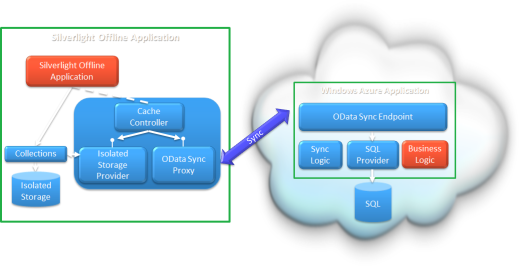](images/syncfx002.png)

For synchronizing data, the Sync Framework makes use of the OData protocol. Since OData is an open standard all kinds of platforms are able to sync data with the Sync Framework. Out of the box the Sync Framework comes with a provider for SQL Server and SQL Azure. On the client the Sync Framework provides components for Isolated Storage so you can use sync without writing a line of code on both Silverlight for the desktop as Silverlight for Windows Phone 7.

In this article I’m going to demonstrate how to use the Sync Framework in your application for Windows Phone 7 by creating an application to manage a shopping list. As I was using the Sync Framework myself I ran into a couple of problems, so I will add my learnings as well.

## 1. Prerequisites

Before you can use the Microsoft Sync Framework, you need to install the framework itself. To obtain the framework please visit [this](http://www.microsoft.com/downloads/en/details.aspx?FamilyID=afd89099-d589-423c-9762-78096aa95ac2&displaylang=en) page and download the file ‘Download Instructions.mht’. Once you open the file you are prompted with two steps. By following the first step you need to answer a few basic feedback questions before you are redirected to the Microsoft Connect site. Once you are transferred to the Microsoft Connect website, click on ‘Downloads’ menu option on the left. You’re now at the download page. Please read the description carefully. It tells you that you need to install the Microsoft Sync Framework 2.1 first before installing the 4.0 CTP. Choose the operating system version that is most appropriate to you. Note that when you’re running the 64-bit version of Windows you need to install the 32-bit redistributables of the Sync Framework 2.1 in order to test in Visual Studio.

Now you have installed the Microsoft Sync Framework, the next step in this sample is setting up the sample database. To do this, download the following SQL file and open and run it in SQL Server Management Studio. This will create a new database named ‘ShoppingList’ and polulate some sample data.

[ShoppingList.sql.zip](/images/ShoppingList.sql_1.zip)

## 2. Generate Sync Configuration

The sync configuration describes what data you want synchronized. The configuration contains the name and location of the data store, what entities to synchronize and what filters to apply to the entities so you can limit what data is exchanged over the wire. The configuration is used in the next steps to provision the database and generate client and server code.

Since the sync configuration is an XML-file it’s off course possible to craft it by hand, but in this case we’re using the ‘SyncSvcUtilHelper’ tool to do it for us. This tool is limited in what it can do, so if you need more control over the configuration file you can always tweak it afterwards.

The ‘SyncSvcUtilHelper’ tool is a graphical user interface build on top of ‘SyncSvcUtil’ command line tool, which is meant to provision the database and generate code. Generating a sync config isn’t actually a functionality of the ‘SyncSvcUtil’ tool, but for easy of use it’s incorporated in the ‘SyncSvcUtilHelper’ anyway. You find both tools in the ‘bin’ directory of the Microsoft Sync Framework SDK installation directory, which is by default ‘C:Program FilesMicrosoft SDKsMicrosoft Sync Framework4.0bin’ on 32-bit and C:Program Files (x86)Microsoft SDKsMicrosoft Sync Framework4.0bin on 64 bit Windows.

Once you fire up ‘SyncSvcUtilHelper’ you’re presented with the main screen with 3 options:

1. Generate or Edit Sync Configuration
2. Provision or Deprovision
3. Code Generation

[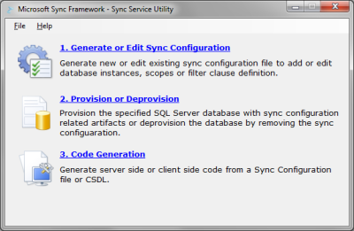](images/syncfx003.png)

By executing all these three steps in this order gives you all you need to be able to sync data between server and a Silverlight-based client. In this case you obviously use the first option to generate the sync configuration. On the first screen specify a file name for the sync configuration file. It’s best to save the configuration file in the same directory as the ‘SyncSvcUtilHelper’ since you’re going to need it in the subsequent steps and the tool defaults to this directory.

[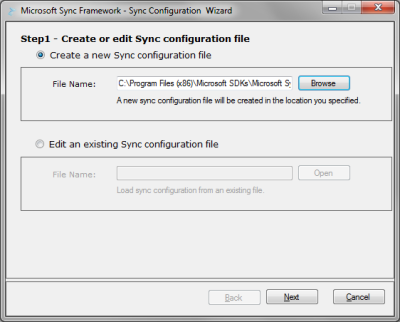](images/syncfx004.png)

On the next screen you need to enter the details of the database that you’ll use to sync data with. Click on the Add button to add a new database. Enter the details of your database and click the Save button to add your database. Click the Next button to go to the next screen.

[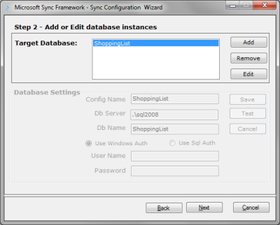](images/syncfx005.png)

In this screen you define the synchronization scopes of our application. A synchronization scope defines what data to synchronize for that scope. You can have multiple scopes for different synchronization purposes. In this case you use just one scope and name it ‘DefaultScope’. To add a scope click the Add button and enter the scope name. For schema name, use ‘dbo’ and make sure you check the box in front of ‘Is Template Scope’ since a template scope allows us to apply filters. Click the Save button and then Next to continue.

[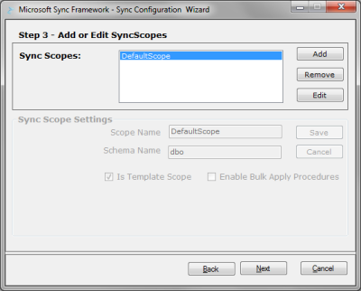](images/syncfx006.png)

Here is where you choose what entities (tables) you want to synchronize and on what columns you want to enable filtering. To choose the tables to synchronize, click the ‘Add/Edit’ button. In the new window select the database you’ve configured a few screens back and a list of tables is shown. Select all columns of both tables for syncing and enable filtering on the ‘Id’ column of the ‘User’ table and ‘UserId’ column of the ‘Item’ table. Click the ‘OK’ button to close the window and click the Next button to continue.

On the first screen you see when you chose step 2, you open the sync configuration file you created before. Since you only have one database and sync scope, they are selected by default, so you can just click the ‘Next’ button to continue.

[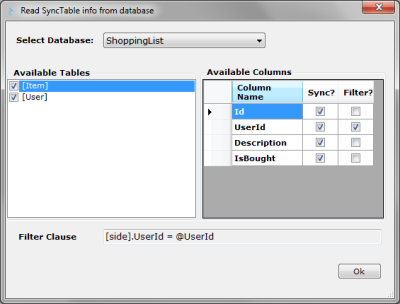](images/syncfx007.png)

The summary screen shows you the details of the sync configuration that’ll be saved to the file. Once you click the ‘Finish’ button, the file is created and the tool is closed.

## 3. Provision the database

Open the ‘SyncSvcUtilHelper’ tool again, but this time choose step 2, in which you’ll provision the database. By provisioning the database, additional tables are created for all the tables you configured in the sync configuration file. The additional tables store sync related information so the Sync Framework can calculate diffs and detect conflicts.

On the first screen you get once you chose step 2, you open the sync configuration file you created before. Since you only have a single sync scope and target database they’re selected by default. Click the ‘Next’ button to start provisioning the database.

[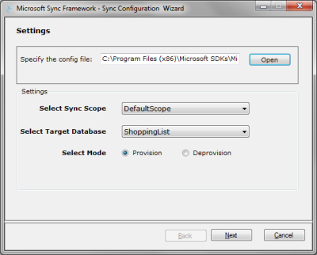](images/syncfx008.png)

If provisioning of the database was successful you can close the tool by clicking the ‘Finish’ button.

[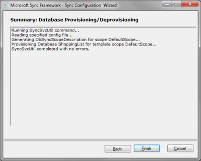](images/syncfx009.png)

## 4. Create the Sync Service

A full Sync Framework solution consists of a Sync Service on the server that speaks OData and an offline context on the client for storing data offline and tracking changes. In this step you’ll create the Sync Service.

To do so you first need a web application to host the Sync Service. Fire up Visual Studio 2010 and create a blank solution (File > New Project > Blank Solution) and name it ‘ShoppingList’. Then add a new ASP.NET Empty Web Application to the ShoppingList solution, named ‘Web’. Add a reference to ‘Microsoft.Synchronization.Services.dll’ which can be found in the ‘Server’ directory of the Microsoft Sync Framework 4.0 installation directory.

Now you have an empty web application to host you need to create the sync service. To do this you use the ‘SyncSvcUtilHelper’ tool again, but this time choose step 3. On the screen you’re presented with open the sync configuration file and click the ‘Next’ button.

[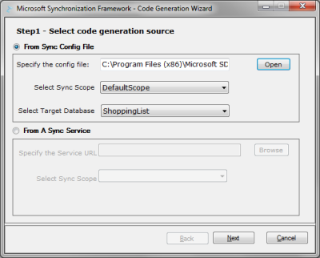](images/syncfx010.png)

On the ‘Select code generation parameters’ screen, select ‘Server’ as the codegen target. Specify the ‘Web’ directory of your ShoppingList solution as the output directory. You can choose whatever language, namespace and output file prefix you like. I used the parameters as in the screenshot below. Click the ‘Next’ button to start the code generation.

[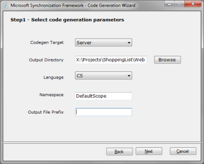](images/syncfx011.png)

If the code generation completed successfully you can close the tool and return to Visual Studio. In the solution explorer, click the button to show all files and include both DefaultScopeEntities.cs and DefaultScopeSyncService.svc.

Before you can use the Sync Service, you need to change a couple of lines of code. Right click DefaultScopeSyncService.svc and choose ‘View code’. Replace the body of the ‘InitializeService’ method with the following lines of code:

config.ServerConnectionString = @"Data Source=.SQL2008;Initial Catalog=ShoppingList;Integrated Security=True;MultipleActiveResultSets=True"; config.SetEnableScope("DefaultScope"); config.AddFilterParameterConfiguration("userId", "User", "@Id", typeof(int)); config.AddFilterParameterConfiguration("userId", "Item", "@UserId", typeof(int)); config.SetSyncObjectSchema("dbo"); config.UseVerboseErrors = true; config.EnableDiagnosticPage = true;

Lines 1 and 2 define the connection string to the database and which scope to use for synchronization.

Lines 3 and 4 are used to add a mapping for parameter ‘userId’ to the filters you defined when creating the sync configuration file. By using the same parameter name for both filters, the client only has to provide a single value to be able to filter both tables.

The lines 6 and 7 are only used for diagnostics and should be turned off in a production environment. UserVerboseErrors enables full errors to be send back to the client in case of an exception. This comes in handy when trying to find out why you’re service isn’t syncing properly. EnableDiagnosticsPage enables a page that shows you whether the basic server configuration is valid. This page is the first thing you check if you want to know if the Sync Service is working.

Now check if your Sync Service is working by right clicking ‘DefaultScopeSyncService.svc’ and choosing ‘View in browser’. The page should load correctly. Then change the ‘$syncscopes’ parameter in the url to ‘$diag’ and press enter. If all tests passed, except for the ClientAccessPolicy/CrossDomain files, you’re ready to continue to create the Windows Phone 7 client.

## 5. Create the Windows Phone 7 client

Add an empty Windows Phone 7 application to the solution. In this example I named it ‘ShoppingList’. Add a reference to ‘Microsoft.Synchronization.ClientServices.dll’ which can be found in the ‘ClientWP7′ directory of the Microsoft Sync Framework 4.0 installation directory. Also add a reference to the Silverlight 3 version of ‘System.ComponentModel.DataAnnotations.dll’. This assembly van be found in C:Program FilesMicrosoft SDKsSilverlightv3.0LibrariesClient (32 bit) or C:Program Files (x86)Microsoft SDKsSilverlightv3.0LibrariesClient (64 bit).

In order to access the sync service and use the entities, you need to generate the client code. Start the ‘SyncSvcUtilHelper’ tool and follow the same steps as when generating code for the server. This time choose ‘IsolatedStore Client’ as the codegen target and specify the Windows Phone 7 application directory, ‘ShoppingList’. The ‘IsolatedStore Client’ generates code that uses IsolatedStorage for storing the synced entities and can be used for both Silverlight for the desktop as for Windows Phone 7. Click the ‘Next’ button to start the code generation.

[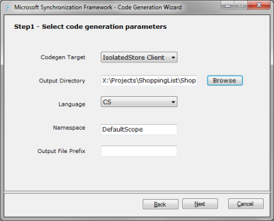](images/syncfx012.png)

If the code generation completed successfully you can close the tool and return to Visual Studio. Make sure the Windows Phone 7 project is selected and in the solution explorer, click the button to show all files and include both DefaultScopeEntities.cs and DefaultScopeOfflineContext.cs.

Now open up MainPage.xaml.cs and replace all the code with the following:

using System; using Microsoft.Phone.Controls; using Microsoft.Synchronization.ClientServices.IsolatedStorage; namespace ShoppingList { public partial class MainPage : PhoneApplicationPage { private DefaultScope.DefaultScopeOfflineContext context; // Constructor public MainPage() { InitializeComponent(); context = new DefaultScope.DefaultScopeOfflineContext( "ShoppingList", new Uri("http://localhost/ShoppingList/DefaultScopeSyncService.svc") ); context.CacheController.ControllerBehavior.AddScopeParameters("userId", "1"); DataContext = context; context.LoadCompleted += context_LoadCompleted; context.LoadAsync(); } void context_LoadCompleted(object sender, LoadCompletedEventArgs e) { context.CacheController.RefreshAsync(); } private void ApplicationBarIconButton_Click(object sender, EventArgs e) { context.CacheController.RefreshAsync(); } } }

In lines 16 to 19 the DefaultScopeOfflineContext is initialized with the path in IsolatedStorage to store the offline data and the Uri to the sync service. In line 20 a parameter is added for the userId. For each client parameter name on the server you need to add a scope parameter on the client. In this case there’s just a single client parameter ‘userId’, which is mapped on the server to two table fields. In the sample data in the database there are two users you can try: IDs 1 and 2. In line 21 the DefaultScopeOfflineContext is set as DataContext so you can use it in the XAML bindings. In lines 23 and 24 an event handler for LoadComplete is assigned and the context is asked to load the offline stored data from IsolatedStorage. Once the offline data is loaded, the CacheController is asked to refresh, which calls the sync service to synchronize the offline data with the live data on the server. Once the sync completes, the data in the offline context is in sync with the server data, which is done in line 34.

Open up MainPage.xaml and add a ListBox to the ContentPanel Grid using the following piece of XAML. This creates a ListBox that binds to the ItemCollection propery of the DefaultScopeOfflineContext which contains the items in your shopping list. A CheckBox is used so you can mark the item as bought.

<phone:PhoneApplicationPage.ApplicationBar> <shell:ApplicationBar IsVisible="True" IsMenuEnabled="True"> <shell:ApplicationBarIconButton IconUri="/Images/appbar_button1.png" Text="Sync" Click="ApplicationBarIconButton_Click"/> </shell:ApplicationBar> </phone:PhoneApplicationPage.ApplicationBar>

Return to the MainPage.xaml.cs and add the event handler for the ApplicationBar button using the following piece of code. This makes sure any changes made by the user are persisted to the IsolatedStorage first and then start the synchronization.

private void ApplicationBarIconButton_Click(object sender, EventArgs e) { context.SaveChanges(); context.CacheController.RefreshAsync(); }

Now your application is ready to test! Make sure the Windows Phone 7 project is marked as startup project and then press ‘F5′ to start debugging. Once the application is started you should soon see a list of shopping list items. Try making changes on the client by marking an item as bought and click the sync button and notice that the IsBought value changed in the database. Also try adding additional items to the Item table in the database and notice the items appear in the list in the Windows Phone 7 client as soon as you click the sync button again.

[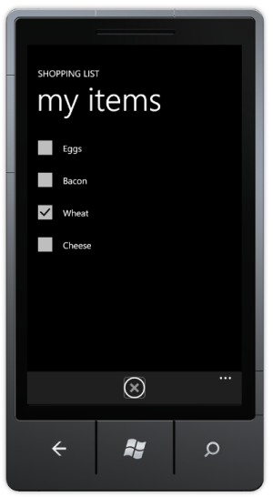](images/syncfx013.png)

## Debugging a sync service

Having trouble with your sync service, but don’t have a clue what’s wrong? Debugging a sync service is a bit tricky. As you probably noticed during your own investigation, you can handle the RefreshCompleted event of the CacheController, but all you find when inspecting the Error property of the RefreshCompletedEventArgs is a ‘The remote server returned an error: NotFound.’. Before explaining how to do it, here are a few questions I compiled after stepping into a couple of common errors myself:

- Open the Diagnostics page. Do all tests pass?
- Did you provision the database? Re-provisioning doesn’t hurt, so just try it.
- Did you add lines of code to the sync service code behind setting the connection string and sync scope name? When regenerating the server code, this file could be overwritten.
- Did you add filter parameter configurations for all the filter parameters in your sync service config on the server?
- Did you add parameters on the client for each parameter mapping on the server?
- Are the names and types of the filter parameters on the server equal to the GlobalName values in your sync service configuration?
- Does the account under which the sync service runs have access to the database in the connection string?
- Did you specify the correct Uri on the client? Try the Uri in your browser to make sure it is correct.

If all of the above didn’t help it’s time to start debugging the sync service. For debugging you use a common HTTP-traffic monitor tool called Fiddler2. [Download Fiddler2](http://www.fiddler2.com/Fiddler2/version.asp) and install it. Next start Fiddler2 and configure it to allow remote connections, as described in [this blog post](http://blogs.msdn.com/b/fiddler/archive/2010/10/15/fiddler-and-the-windows-phone-emulator.aspx). You should be able to capture the internet traffic of the Windows Phone 7 emulator by now. Make sure you start the emulator after you started Fiddler2, so if it is running, restart it first. Open internet explorer on the emulator and browse to a particular website. Fiddler2 should show you the internet traffic.

Since the ASP.NET Development Service doesn’t allow remote connections and the emulator is regarded as a remote device, you need to configure the web application to run in IIS. Note: I assume you’re running Vista or Windows 7 and you already installed IIS 7. Open the properties of the web project and go to the ‘Web’ tab. Select to use the local IIS web server and specify a Url, see example below. Click ‘Create Virtual Directory’ to create the virtual directory if it doesn’t exist yet.

[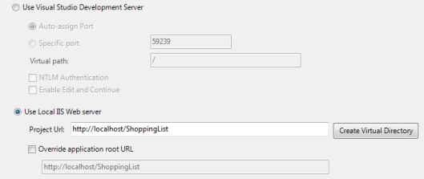](images/syncfx001.png)

Fiddler2 doesn’t capture traffic going to localhost, so in order to capture your sync service traffic go to MainPage.xaml.cs in your Windows Phone 7 application and replace localhost with the computer name in the Uri to the sync service. Make sure the Uri points to the IIS hosted sync service.

In the DefaultScopeSyncService.svc.cs file in your web project, make sure you enabled UserVerbodeLogging by adding the following line of code:

config.UseVerboseErrors = true;

Now, if you encounter a synchonization error, go into Fiddler2 and lookup the faulted web session, which is indicated with status 500. Click the ‘TextView’ button of the response area (bottom right part of the screen) in order to see the plain error message that was transmitted over the wire.

[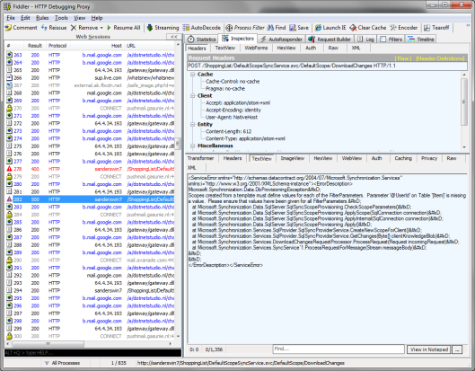](images/syncfx014.png)

[Download sample project](/images/ShoppingList1.zip)

