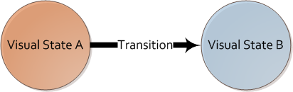
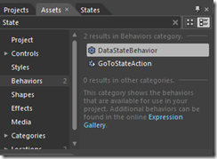

{
  "author": "Sander Schutten",
  "date": "2011-03-14T12:17:44Z",
  "description": "",
  "draft": false,
  "slug": "advanced-mvvm-doing-visual-states-properly",
  "title": "Advanced MVVM: Doing visual states properly",
  "menu": {
    "sidebar": {
      "name": "Advanced MVVM: Doing visual states properly",
      "weight": 201103,
      "identifier": "advanced-mvvm-doing-visual-states-properly",
      "parent": "2011/03"
    }
  }
}

An important plus of rich internet applications is the potential user experience you can achieve by applying UX patterns. A part of this is the visual states and their transitions. A visual state determines what the user interface looks like at a certain point in time and the transitions describe how the application moves from one visual state to the other, many times using animations to enhance the experience.

The most obvious way when you’re unfamiliar with XAML is to change the visual state of an application by writing code to show or hide controls when events occur, like e.g. a button click. Besides that on many occasions it requires a considerable amount of code, it doesn’t fit properly with the Model-View-ViewModel pattern. Although the pattern doesn’t prevent you from writing code in the codebehind as long as it related to the View, the pattern encourages to do it as little as possible.

The next commonly seen approach from people that want to stick to the MVVM-believes is to show/hide controls by binding properties like Visibility and Opacity to the ViewModel. This works fine for simple visual states, but has a couple of downsides, such as hard to maintain when a lot of controls are part of the visual state change, no support for animations and lack of seperation between View and ViewModel.

The only real proper way of doing visual states with WPF or Silverlight (phone / desktop) is through the VisualState-property of controls and pages. Each visual state in the VisualStates-property has a set of deltas to the base visual state, like the change of opacity of a button to 100%. Each visual state can furthermore contain transitions to and from the state if required. You can write the XAML for the visual states and transitions by hand, but it’s more convenient to use Expression Blend for this. In Expression Blend there’s the States-tab on which you can create or edit the visual states of any control, even the default controls when using a custom template.

The process of creating visual states and transitions can be found on many places on the web. The difficulty, however, lies in triggering a visual state transition, which is done using the VisualStateHelper class from code in many of the examples you’ll find. If you’re doing MVVM this becomes cumbersome since you need to track the properties of the View and trigger the appropriate state changes from code.

This is where behaviors come into the picture. Expression Blend 4 comes packed with a couple of behaviors that make it easy to do visual state changes without writing a single line of code. These are:

- GoToStateAction
- DataStateBehavior

GoToStateAction calls the VisualStateHelper.GoToState() when an event occurs. To what state to transition and on what event can be configured. DataStateBehavior acts as an if-else statement. In your ViewModel you expose a boolean property determining the state of your application. You configure through data binding to inspect this property and what visual states the application should go to when the value is either true or false. E.g. you can use this behavior for hiding / showing controls depending on user rights. On your ViewModel you define for example a CanEdit property of type boolean and using the DataStateBehavior you switch between the ReadOnlyState and EditableState visual states.

When you want more functionality, there’s also the [Expression Blend Samples](http://expressionblend.codeplex.com/). Although the name suggests differently, the Expression Blend Samples contains some very mature additions to the default Blend behaviors and triggers. The package included the DataStateBehavior since Blend 3, which is now packed with Blend 4. The package also contains the DataStateSwitchBehavior, which, as its name suggests, acts like a switch statement. It’s basically the same as the DataStateBehavior, but with multiple possible values besides just true or false. To use this behavior you expose an enumeration property on your ViewModel and use the DataStateSwitchBehavior to switch to particular visual states for each of the enumeration values. You can use this for example with the application roles of your application, e.g. Guest, Contributor and Administrator.

