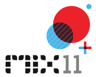

{
  "author": "Sander Schutten",
  "date": "2011-04-13T11:18:00Z",
  "description": "",
  "draft": false,
  "slug": "mix11-day-1",
  "title": "MIX11: Day 1"
}

Today was the first conference day and my second day at MIX11. The day began with a keynote and after that a couple of sessions. These are my findings of today.

## Keynote (Dean Hachamovitch, Scott Guthrie)

Dean started off with looking back at the development of IE9 and how successful is has been so far. Then he announced that they’re already three weeks into development of IE10, which didn’t come as a surprise looking at the shirt he was wearing with a bit TEN on it with the ‘E’ being the IE logo. The rest of his talk goes on showing the performance compared to ‘other’ browsers (it was Chrome) and how much the standards have conformed. I’m no big HTML fan and got the creeps when he showed al kinds of variations on riadial gradients for CSS3 (-ms-radial for IE, -moz-radial for Firefox, –o-radial for Opera, etc)

A great part of the demo was that in the end it appeared that the IE10 demos were actually running on an ARM 1.0Ghz machine and the performance was great. Dean’s talk concluded with the announcement that the first preview of IE10 is available immediately on [IETestDrive.com](http://ietestdrive.com)

Next up was Scott Guthrie who talked about the web stack. As per today they release the [ASP.NET MVC 3 Toolds Update](http://www.microsoft.com/downloads/en/details.aspx?FamilyID=82CBD599-D29A-43E3-B78B-0F863D22811A&displaylang=en) which includes

- JQuery 1.5 + Modernizr (a tool that automatically provides downward support of HTML5 constructs for HTML4 browsers)
- HTML5 support
- Entity Framework 4.1 support
- Scaffolding

Also announced is that Entity Framework 4.1 (Magic Unicorn edition) is released final today.

The rest of Scott’s talk was about Orchard (yet another CMS), NUGet (a package manager for open source projects; this one is cool, but not completely new) and WebMatrix (kind of like Visual Studio for dummies).

The last bit of the keynote Scott talked about Windows Azure. There will be several new things coming soon, like a new access control service, a new caching service, added content delivery network support and traffic manager support. Umbraco (another CMS being around a little while) demoed an extension for Windows Azure that allows web admins to configure their site to automatically scale upon traffic during certain periods. This looks like a unique selling point for Umbraco and fairly easy to configure.

## HTML5 for Silverlight Developers (Giorgio Sardo)

In this session I was expecting to get explained when to use what technology so a Silverlight developer like myself knows when HTML5 is a better option compared to Silverlight. Unfortunately, Giorgio pointed out all the similarities between HTML5 for most of the session. For example, he took a duck crafted in XAML with Expression Design and showed how ‘easy’ it was to convert that to AVG (the vector format for HTML5). These conversions involved a lot of copy paste and custom built tools which showed again that tool support for HTML5 is lacking and should be priority one if they want Silverlight developers to be interested.

## Deep Dive MVVM (Laurent Bugnion)

I doubted a lot if I would go to this session since I didn’t know exactly what deeper one could go with MVVM. Much deeper as it turned out. Laurent’s session overall was too much code and jumping back and forth between screens, files and tools to be able to follow it well. He assumed a little too much that attendees used MVVM Light before and also are comfortable with terms like IoC (Inversion of Control). His basic message was one of interest though, which is if you want to improve MVVM in your application and want to get rid of some tight coupling like e.g. you have with dialogs, you should use dependency injection and/or behaviors. He showed how these technologies can help you removing any of the tight coupling and keep you ViewModels testable.

## Inspiring UX (Thomas Lewis, August de los Reyes, Corey Schuman and Chris Bernard)

This was by far the most inspiring session so far. The idea behind the session is that every speaker has just ten minutes for their talk and their slides are timed and transition automatically. It was a great joy to see how well all speakers were able to time their words just right, where August’s talk topped everything by keeping in sync with every word on his slides. Besides the format, the contents of the talks was also interesting. When we walked out of the room we were inspired to do more with UX and felt that event the most boring battleship grey forms we work with on a daily basis could be improved to make it a pleasant experience for the user.

Today is day 2 of MIX11 and we expect some serious announcements regarding Kinect and Windows Phone 7. Why Kinect? Well, we noticed about six of them were lined op on stage yesterday during the keynote. Will the Kinect SDK be released today?

