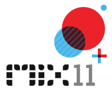

{
  "author": "Sander Schutten",
  "date": "2011-04-14T11:19:00Z",
  "description": "",
  "draft": false,
  "slug": "mix11-day-2",
  "title": "MIX11: Day 2"
}

Today was a really interesting day, with lots of new stuff being announced and sessions packed with interesting information. These are my findings of this day.

## Keynote (Joe Belfiore, Scott Guthrie)

The keynote started off with an inspiring viral video. It appears a fan of Windows Phone created it by request of Microsoft after he created his own viral out of love of the phone. If the viral gets over 200k of views on YouTube, it is turned into a real commercial. Support this by watching the video [here](http://www.youtube.com/windowsphone).

Joe went on talking about the next version of Windows Phone, codenamed Mango. It will be on new phones fall this year and includes 16 more languages, more countries for app creation (38 instead of 30) and more countries for app commerce (30 instead of 16). This includes the Netherlands.

Mango has a lot of new features and Joe showed a lot of them. The new features include:

- App jump list, just as you’re used to with contacts, to quickly find the installed app you’re looking for
- App list search to find an installed app, which can also directly search the marketplace
- The marketplace was redesigned to have separate pivots for reviews and related apps, making it easier to navigate
- Once you install an app from the marketplace, you’re taken to the app list directly and there you can see the app being installed
- Added extras pivot on music and video hub showing apps that integrate with the hub
- Full IE9 engine built-in to the OS
- The address bar of the browser is moved to the bottom to free up more screen real estate. It is also available it landscape mode now.
- Because it uses IE9, it supports HTML5
- The HTML5 audio tag allows playing audio in the background, even if you leave the browser
- Live tiles now allow animation, multiple live tiles per app and can be updated without the push notification service
- Live tiles support deep linking into an app, allowing you to directly jump to a specific part of the app
- Sockets are now available allowing apps to be built like the demoed mIRC app
- There’s a built-in SQL CE database available to your apps, making it easy to store data locally, e.g. for caching
- There are more launchers and choosers available for choosing things like contacts, images. You can also now jump directly into locations (Bing maps)
- Additional sesnor access available, like raw camera, compass and gyro access
- Custom ringtones can be created by applications
- A motion sensor API, making it easy for developers to leverage the compass and gyroscope to write motion oriented apps without caring too much about the tedious math involved
- Multi-tasking for audio, downloads, alarms and custom tasks
- Fast app switching, which makes returning to apps lightning fast and allows you to see what apps are kept in the background in a dormant state (this could be compared to ALT+TAB on Windows)

A couple of announcements were made while demonstrating the new features, like:

- Skype to come to WP7 this fall, when Mango is released
- Spotify to come to WP7 in the near future
- Angry Birds coming to WP7 on May 25th
- Kik messenger available the coming weeks, finally providing a good cross platform messenger
- The updated developer tools for Mango are available next month

Joe hands over to Scott Guthrie, who talked about developer enhancements for Windows Phone 7.

Scott kicks off with showing enhancements to the emulator that enable you to emulate the accelerometer and locations. The accelerometer emulation works by showing a 3d model of the phone and a pivot point you can grab with your mouse that allows you to mouse the model of the phone. The locations allows you to place points on a map that are directly forwarded to the phone as geo locations. Both emulations also allow recorded actions to be repeated, like shaking the device of moving along a certain path.

Next up Scott demoed the out-of-the-box performance analysis tools, that allow you to get very detailed information on the performance of you app over time. Once the new SDK comes out it should even work on current WP7 apps.

The team also made additional performance optimizations to the platform that don’t require you to write any additional code. As I understood it, the only thing you need to do is recompile the app. The performance optimizations include:

- Scrolling and input is much smoother and doesn’t block the UI
- Image decoding is done off the UI thread, which makes sure the UI isn’t blocked when you need to load a list of images
- Garbace collection is improved so that it occurs more times, so that it does need to do less work and is scheduled to occur when your app is idle
- Memory usage is improved so your app consumes about 30% less memory, again without writing a single line of code

Mango includes 1500+ new APIs. It uses the full Silverlight 4 feature set, so it leverages those features too, like sockets. It now also allows you to combine Silverlight with XNA, so you can use all the 3D glory in your Silverlight app.

Up next: Silverlight 5. Also on the field of Silverlight 5 news is available. To start of with, Silverlight 5 gets hardware based video decoding, bringing 1080p video to netbooks. They also added something they call ‘Trickplay’ that allows you to speed up or slow down a video, but with pitch correction, so voices don’t sound like Alvin & the Chipmunks. Lastly, on the media part, they also added remote control support. All these additions make Silverlight the premier platform for streaming media.

John Papa continued to show off some new 3D features of Silverlight 5. Het showed a Silverlight application that uses the XNA APIs to show a 3D model of a house. He demoed 2D to 3D projection, which allows you to take 2D Silverlight controls and project them against a 3D model, so that the 2D control aligns with the model. The source code of all this is available next month.

Some additional new features include:

- Binding in Style setters, so that you can alter styles at runtime
- Implicit data templates, allowing you to specify a data template for e.g. a list box based on the type of the bound object. When you do this, the template is applied everywhere in your app where that type of object is bound
- Data binding debugging, allowing you to set a breakpoint in XAML and see detailed information about the binding

The Silverlight 5 beta is now available [here](http://www.silverlight.net/getstarted/silverlight-5-beta/).

Finally Jeff Sandquist came on stage talking about Kinect and how many they sold (over 10 million). His announcement was something I was looking forward too since yesterday when I noticed a lot of Kinects on stage: the Kinect SDK will be released later this spring.

His talk continued to show all the cool things you can do with Kinect and the SDK, like a sofa on wheels! Check them [here](http://channel9.msdn.com/Blogs/C9Team/Kinect-Demos-with-the-Channel-9-team).

## Building In Browser Experiences With Silverlight 5 (Steve Lasker)

In this session, Steve dove a little deeper into many of the new Silverlight 5 features. Not all features are available in the Silverlight 5 beta yet. One of them is vector based printing, something that wasn’t announced at the keynote yet. In Silverlight 4, printing is done by converting the control to be printed to a bitmap which is then sent to the printer. This is not so efficient since these bitmaps can become very large and printing becomes really slow. It also defeats the possibility to print to PDF since all you get is a bitmap inside a PDF. With vector based printing the vectors are sent to the printer, so no more bitmaps when not necessary.

## Get Ready For Fast App Switching In Windows Phone (Adina Trufinescu)

In this session Adina talked about how fast application switching works and what you need to do to leverage it. In the current version of WP7, when the user presses the back or Windows button when in your app, the app is deactivated and then tombstoned. The the deactivated phase you can store the state of the application before it gets killed. When the user returns to your app, it is activated and then running. In the activated phase, you can restore the state you saved earlier during the deactived phase.

In Mango, the app doesn’t get tombstoned directly after the deactivated phase. Instead it enters a new state called ‘Dormant’. In this state, the app is kept in memory as is. As long as there’s memory available it stays there, but as soon as the OS needs more memory, e.g. another app is started, the app can be tombstoned anyway. The difference with the previous method is actually in the activated phase. In this phase you now need to check whether the app was dormant or tombstoned. Only in the latest case you need to reload the state. You can see if the app was dormant if the new property IsAppInstancePreserved equals true.

It might be you need to do additional work in the activated phase. Because of resource usage, the phone OS terminates things like timers, access to camera, audio etc when the app enters the deactivated phase. In most of the cases, the OS resumes these things, but not in all. For e.g. if you have a MediaElement on your page, you need to write some code to resume it, since the OS doesn’t do it for you.

## What’s New In The Windows Phone Developer Tools (Vibhor Agarwal)

This session was a total let down, since it was exactly the same as what Scott Guthrie already talked about during the keynote.

## Crafty UX (Sara Summers, Nathan Moody, Robert Tuttle and Guido Rosso)

This was again a UX Lightning series, where there were four speakers and each had exactly ten minutes to do their talk. Although not as inspiring as yesterdays UX Lightning series, it was still fun. One thing that I noticed was the difference in ideas of the speakers. Where one said you should stay away from the computer at all when you’re prototyping, another said you should create experiences that are really close to the final result by doing videos etc. One thing I got from this session was: It doesn’t matter how you prototype, but please, do something. Don’t start building right away.

## Multitasking In The Next Version Of Windows Phone, Part I (Darin Miller)

Another really interesting session where Darin explained the multitasking model and the choices Microsoft made and why. Microsoft wants to support multitasking, but on the other hand be careful with the resources of the phone, like battery and network usage. It is always a balance between user experience and health.

There are a couple of system services for doing multitasking, or background work rather. These are:

- Alarm and Reminder, allowing you to pop up an alarm or reminder just like the rest of the phone does. They are persisted across reboots and can be turned off by the user. To add an alarm or reminder, you instantiate one in your app and call ScheduledActionService.Add() with the instance.
- Background transfer service, allowing you to download or upload data in the background. Even if you’re just doing downloading or uploading in the foreground, this API is really useful. It has a download maximum of 20MB over the cell network, but allows more when connected to Wifi. If no Wifi is available, the download is scheduled and will automatically begin once connected to Wifi. Uploads are limited to approx. 3MB, but this needs validation by Microsoft. To schedule a background transfer, you instantiate a BackgroundTransferRequest and call ScheduledActionService.Add() with the instance.
- Background audio, allowing you to play audio in the background just as Zune does. The simplest method is using the audio tag on a HTML5 webpage. The OnEnded trigger specified in the tag still fires, even if the browser is not open, allowing you to advance to the next track. The more advanced method is by using the BackgroundAudioPlayer class. This enables previous and next track functionality in the menu when you press the volume rocker on the phone. There are two methods: URL and Streaming where the latter allows you to decrypt / decompress the audio.

When you want to do more, you can write your own agent. An agent can do a lot of stuff, but not everything is allowed.

- Allowed: Tile updates, Toast notifications, Location access, Network access, Read/Write isolated storage, sockets and most framework APIs.
- Restricted: Displaying UI, access XNA libraries, access microphone, access camera, access sensors, play audio (except for background audio APIs)

There are two types of background agents: PeriodicTask and OnIdleTask. They are all persisted across reboots. There’s a limit of 18 agents in total, but this number might change as Microsoft is validating this number. An agent can be scheduled for 14 days. You could try to set it longer, but it will still run for just 14 days. After the 14 days the agent is stopped. Your app can renew this schedule. This method prevents agents to be running when the user is actually not interested in the app anymore. Again this is an example of caring about the resources of the phone.

Periodic agents are executed every 30 minutes and may take 15 seconds max to execute their work. Periodic agents are scheduled to run sequentially to reduce the total CPU load. They are also executed as close as possible next after each other to limit the network usage, since network connection needs to be made and released by the OS.

On idle agents are only executed on external power or with non-cell network. They are allowed to run for up to 10 minutes and can be user for heavier tasks, like initial data sync.

Today is already the last day of MIX11. I don’t expect a lot of new stuff today, but love to hear more about yesterdays announcements.

