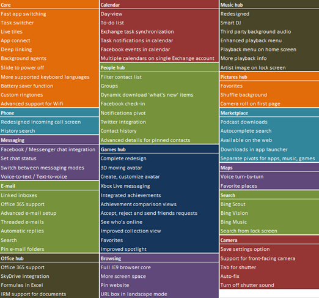

{
  "author": "Sander Schutten",
  "categories": [
    "dotnetmag",
    "Features",
    "Mango",
    "Windows Phone 7"
  ],
  "date": "2011-07-05T11:40:23Z",
  "description": "",
  "draft": false,
  "slug": "windows-phone-7-mango-features",
  "tags": [
    "dotnetmag",
    "Features",
    "Mango",
    "Windows Phone 7"
  ],
  "title": "Windows Phone 7 Mango features",
  "menu": {
    "sidebar": {
      "name": "Windows Phone 7 Mango features",
      "weight": 201107,
      "identifier": "windows-phone-7-mango-features",
      "parent": "2011/07"
    }
  }
}

A lot has been said and written about Windows Phone 7 Mango. The eagerly awaited update to Microsoft’s new Windows Phone platform is said to sport 500 new features, bringing it up to par with its competition. While 500 features sound a lot, it may well be achieved if you count every little detail. Many of the bigger features can be found all over the web, especially in the much detailed [Engadget in-depth preview](http://www.engadget.com/2011/06/27/windows-phone-7-5-mango-in-depth-preview-video/). However, a comprehensive list showing all new features hasn’t been published yet. The table below is my attempt to sum up all the features I have found using my own phone with the Windows Phone 7 Mango beta for developers and browsing the Internet. I focused on the consumer features and left out the features available to developers, like e.g. raw camera access or the calendar API. If you think I missed some, please let me know and I’ll add them. Click on the image for a larger view.

