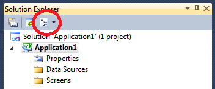
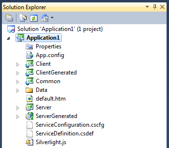
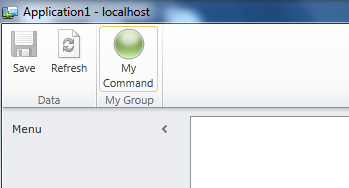

{
  "author": "Sander Schutten",
  "categories": [
    "dotnetmag",
    "lightswitch",
    "Silverlight",
    "visual studio"
  ],
  "date": "2011-08-10T18:10:44Z",
  "description": "",
  "draft": false,
  "slug": "lightswitch-custom-ribbon-button",
  "tags": [
    "dotnetmag",
    "lightswitch",
    "Silverlight",
    "visual studio"
  ],
  "title": "Lightswitch: custom ribbon button"
}

Two weeks ago, on July 26th, Visual Studio Lightswitch 2011 was released. I ‘d seen a couple of videos what you can do with Lightswitch so I though I’d put it to the test by developing a replacement for a tool I use at one of my clients. Lightswitch is really easy to use and I believe I can actually teach my wife to create data-centric application using it. Until you reach the limits though, because than it becomes more difficult really fast. The main reason for this is that there’s not much documentation available on the inner workings of Lightswitch and how to hook into some of it. One of the things I ran into was how to add my own button to the ribbon that is available on every screen, like the default Save and Refresh buttons are (unless you explicitly set them not to be visible on a screen).

## Extending Lightswitch applications

Like with many things, if you know how to do it, it’s not that hard. Lightswitch makes heavy use of the Managed Extensibility Framework, MEF. To extend the default behavior of Lightswitch you need to implement certain interfaces and export your implementation using the MEF Export attribute. There are multiple places your extension could live:

- A Lightswitch Extensibility solution
- A Silverlight class library
- In the Lightswitch application itself

The Microsoft preferred place if the Lightswitch Extensibility solution, but I believe that’s overkill if you just want a button specific to the application you’re building. The Lightswitch Extensibility solution is a perfect way to build extensions for Lightswitch that you want to reuse for multiple applications, e.g. a certain shell style of theme for the company you work for. To create a Lightswitch Extensibility solution, you need to have the Lightswitch Extensibility Toolkit, available [here](http://msdn.microsoft.com/en-us/lightswitch/hh304488). Note that you also need Visual Studio 2010 Pro and the Visual Studio 2010 SP1 SDK in order to use the toolkit.

The Silverlight class library is a good option if you have extensions specific to your application. It works the same way as extensions in the Lightswitch application itself, but makes for a better separation of generated and custom code.

The last option is good if you want a quick extension to your application. In this example I use this method because it’s the easiest to demonstrate how it works and allows to focus on the task at hand: adding a button to the ribbon that is available on all screens.

### 

## Adding a class file to the Lighswitch application

It may sound easy to add a class file to the Lightswitch application, but if you don’t know how to do it, it can be quite a challenge. The thing is that a Lightswitch application behaves differently in Visual Studio. It isn’t a normal project with class files, folders and custom controls. It’s a logical view of your application that hides all the generated code from you. But there’s a way to switch to the view which does show the various projects and files that make up your application. In the button strip on the top of your solution explorer, there’s a button on the far right that allows you to toggle between the logical and the file views.

Once you switched to the file view, you see your application is made up by a Client, Common and Server project, where the Client project contains your Silverlight app, the Server project contains all server related stuff like data access and the Common project contains the things shared between the Client and Server project. You can go one step further by choosing to show all files. This is also a button on the button strip on top of your solution explorer. If you toggle to show all files, you also get to see the ClientGenerated and ServerGenerated projects. This is used for example if you need to change a connection string in the web.config, which is located in the ServerGenerated project.

Since the button needs to be added to the Silverlight client, this is where we add the class file. Right click the Client project and choose to add a class. Name it MyGroupProvider.cs. I’ll explain later why we call it a provider.

## Steps to add a custom button

Adding a custom button to the ribbon that is available on all screens involves the following steps:

- Create a class that implements `IExecutable` for executing code when the button is clicked
- Create a class that implements `IShellCommand` which is our button
- Create a class that implements `IShellCommandGroup` which is the group for the button
- Create a class that implements `IShellCommandGroupProvider` that acts as the provider for MEF so Lightswitch can find our button.

## Implement IExecutable

The class that implements `IExecutable` is responsible for executing code when the button is clicked. This interface could be compare to the Silverlight ICommand interface but with some editions. The interface provides properties through which Lightswitch determines if the executable can be executed and methods for executing the code. In addition to the `ICommand` interface, the `IExecutable` interface allows for synchronous and asynchronous execution, allows cancellation of an asynchronous execution and provides a way to handle errors with the execution.

Create a class named MyExecutableObject and implement `IExecutable`. For the executable to work in the ribbon, you need to change the CanExecuteAsync to return true and implement ExecuteAsync to execute the code you want, e.g. showing a screen. The synchronous CanExecute property and Execute method are not used in this case, although I don’t know where they would be used. Make sure to return null in the ExecutionError property and return `Microsoft.LightSwitch.ExecutionState.NotExecuted` for the ExecutionState. Of course you can add your own logic to determine whether the executable can be executed or handle the errors the way you like.

## Implement IShellCommand

Now we have a class that implements `IExecutable`, we need to create a button through which the user can execute it. A button is a class that implements the `IShellCommand` interface. It allows you to specify a description for the button as well as a name. The `ExecutableObject` needs to return a new instance of the MyExecutableObject we just created. Furthermore, to be able to use the button, we need to make sure it’s enabled and visible. To create the button, create a new class named ‘MyCommand’ and implement the `IShellCommand` interface. Make sure to change all property and method bodies to do something and not throw an `NotImplementedException`.

You can specify an image for the button by returning a `BitmapImage` using an image resource. For this you add an image to the Resources folder of the Client project. Then you use the following piece of code to return the image.

## Implement IShellCommandGroup

As of the time of writing I don’t know how to add a custom button to the built-in Data button group, so we’ll create our own group to host our button. We create a new button group by creating a new class that implements the `IShellCommandGroup` interface. This interface lives in the `Microsoft.LightSwitch.Runtime.Shell.ViewModels.Commands` namespace, so make sure to add a using for it.

Implement the interface by right clicking the interface and choosing ‘Implement Interface’. It will generate three properties for you: Commands, DisplayName and Name. Replace the getters of the DisplayName and Name to return the names you’d like to use for your command. The commands property returns a collection of the commands available in the group. In this case we only return our MyCommand. You can construct a collection or use the ‘yield’ keyword as in the example below.

## Implement IShellCommandGroupProvider

You now created you executable, the button and the group. The last thing to do is make sure Lightswitch know about it, so it can add it to the ribbon. To do this, we use a class that implements the `IShellCommandGroupProvider` class. Create a new class named MyGroupProvider and imlement the `IShellCommandGroupProvider` interface. Make sure the GetShellCommandGroups method returns the MyGroup class, since that is the group we want to make available to the Lightswitch application.

To allow the Lightswitch application to discover the group provider, add an Export attribute to MyGroupProvider class with parameter `typeof(IShellCommandGroupProvider)`. The Export attribute is a way for MEF to export definitions in your class library or application, which can be imported elsewhere using an Import attribute. MEF scans the application for all Export attributes and makes them available. The parameter for the Export attribute allows MEF to create filters on the import, so that only particular types are imported. The Lightswitch application imports types that implement the `IShellCommandGroupProvider` and knows what to do with it. This way Lightswitch can discover our command groups and add them to the ribbon.

Now if you run your application you’ll see your button added to the ribbon. Once this is working, you can continue to modify the properties of your button, group and executable to do what you want.

