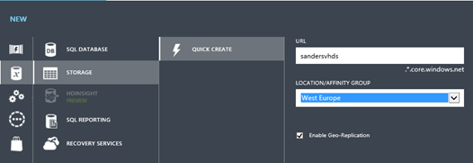
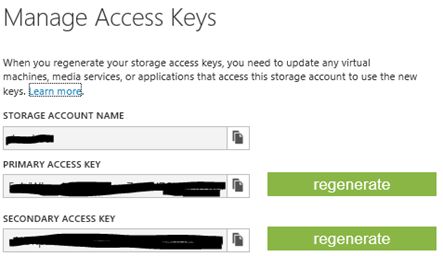
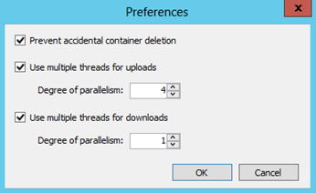
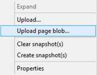
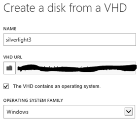
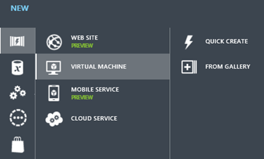

{
  "author": "Sander Schutten",
  "categories": [
    "Azure",
    "iaas",
    "vhd",
    "virtual machine"
  ],
  "date": "2013-06-21T07:37:00Z",
  "description": "",
  "draft": false,
  "slug": "move-your-development-vm-to-azure",
  "tags": [
    "Azure",
    "iaas",
    "vhd",
    "virtual machine"
  ],
  "title": "Move your development VM to Azure",
  "menu": {
    "sidebar": {
      "name": "Move your development VM to Azure",
      "weight": 201306,
      "identifier": "move-your-development-vm-to-azure",
      "parent": "2013/06"
    }
  }
}

During my day job I regularly had to use virtual machines to do my work on. It just simply isn't convenient to run BizTalk Server or SharePoint on you laptop. I've used many types and brands of virtualisation software like Virtual PC, Virtual Server and VMWare. More recently I started using Hyper-V, which, because baked into Windows 8, sounds like a very natural thing to do.

Unfortunately, whatever software I used, the performance I get just doesn't provide a good user experience. Secondly, I'm always juggling with these, sometime huges, VMs, transferring them to external hard drives, copying them etc. Lastly there's also the tradeof between portability and performance of the laptop/tablet I'd like to use for my work and in order to run these VMs it requires quite a beefy machine.

All of these things made me dream of having the option to run my VMs in Azure, so I could access them from any device from anywhere. With the arrival of Azure's Infrastructure-as-a-service offering, this became a viable reality. With the [recent announcement](http://blogs.msdn.com/b/sql_shep/archive/2013/06/10/azure-billing-per-minute-and-no-compute-charge-for-a-stopped-iaas-vm.aspx) that Azure billing will be per minute and you won't be billed for stopped VMs, I think the platform is ready and I decided to take the plunge.

## Condiderations

There are a few ways to have your development VM run in Azure:

- Create and configure the VM in Azure
- Create a custom template and upload it to Azure
- Copy an existing VHD to Azure

Because I currently have VHDs on my machine that I just like to run as-in in Azure, I explored the latter option. I will describe in this post how you can do the same.

**Important**: The newer VHDX format is not supported in Windows Azure. You need to convert the disk to VHD using Hyper-V Manager or the convert-cmdlet. My disk was already a VHD, so I don't have experience with this process.

## Supported OS

The list supported operating systems are either Windows Server 2008 R2 with SP1 (x64) or Windows Server 2012 (x64). Although I didn't find any writing of this I assume this is for creating the templates. I tried copying an existing Windows 7 VHDto Azure and it works just fine. I didn't try with any other operating systems yet, but I'll try Windows Server 2008 next.

## 4 Simple Steps

Copying an existing VHD to Azure proved to be easier than I thought, with the exception of uploading the VHD (more on that in a bit). Follow these steps for copying your VHD to Azure.

These steps assume you already have a working Hyper-V VHD available.

### Step 1 – Create a storage account

The VHDs are stored on Azure in a storage account. To create a new storage account, login to the [Azure Portal](https://manage.windowsazure.com/) and click the big plus sign on the bottom and choose Data > Storage > Quick Create. Enter a valid name for the URL and choose a location that is most close to you.

Once the storage account is created, locate it in the Azure Portal and click the Manage Access Keys button at the bottom. Take note of the primary access key, because we need it for the next step where we upload the VHD to this storage account.

Next, go to the containers section of the storage account and create a new container. You can name it whatever you want.

### Step 2 – Upload the VHD

The next step is to upload the VHD to the storage account for it to be used in Azure. Note that uploading the VHD can take quite some time depending on the size of the VHD and your upload speed.

Uploading the VHD to Azure proved to be a bit of a challenge. First of all you need to make sure you upload the VHD as a **page blob**. It took me 12 hours of uploading to find that out. Then there are [a lot of different third party storage explorers](http://blogs.msdn.com/b/windowsazurestorage/archive/2010/04/17/windows-azure-storage-explorers.aspx) available to manage your storage account, some of which don't support page blobs or only reading page blobs, not uploading them. I tried many of them and personally like [CloudXplorer](http://clumsyleaf.com/products/cloudxplorer) the best. There's an evaluation version available that you can use.

After you installed CloudXplorer and start it for the first time, it'll ask you to add a new account. For the account details, use the name and primary key of your storage account, created in the previous step.

I found the upload to be more reliable when using more threads. You can increase the number of threads CloudXplorer uses for uploading by going to File > Preferences. I've configured mine with 4 threads, but you should play with it yourself. Increasing the number of threads can also increase your upload speed, if you have the bandwidth.

To upload the VHD open the storage account node on the left and right-click the storage container. Choose 'Upload page blob', pick the VHD from your disk and get back to doing other stuff as this might take a while.

Unfortunately I had occasions where the connection was dropped and I had to start the upload all over again. It should be possible to resume uploading, but for me that feature wasn't working.

### Step 3 – Create the disk in Azure

OK, let's assume your upload finally finished, we can now create the disk in Azure to be used as a virtual machine. If you by accident didn't upload the VHD as a page blog, this is the step in the process where you get an error.

In order to create the disk, in the Azure Portal, navigate to Virtual Machines and go to the Disks tab. Click the create button at the bottom to create the disk. Give it a name and pick the VHD URL from the storage account where you uploaded the VHD to. Tell Azure that the VHD contains an operating system from the Windows operating system family.

### Step 4 – Creat the virtual machine

The only thing left to do is to create a virtual machine that uses the disk we just created. To create a new virtual machine, click the plus sign on the bottom and choose Compute > Virtual Machine > From Gallery.

In the dialog that pops up, select My Disks and pick the disk we just created. Continue with the rest of the wizard and choose an appropriate virtual machine size and availability set (optional). Once you complete the virtual machine wizard, it will take a few minutes for Azure to create the virtual machine and start it. It can take a bit of time once the virtual machine is started before Remote Desktop Services are running and you'll be able to connect to it.

## Final words

Now that you have your virtual machine running in Azure, don't forget to turn it off if you don't use it to prevent you from getting charged. This way you can have a fairly large VM with excellent performance, but still limit your costs.

