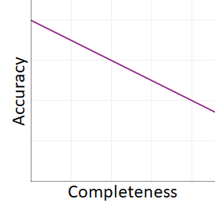
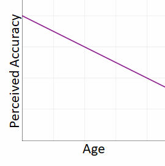
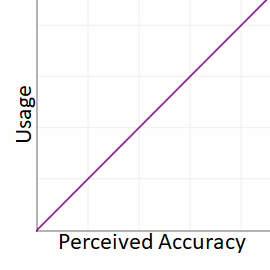
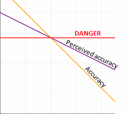

{
  "author": "Sander Schutten",
  "date": "2017-11-10T08:25:28Z",
  "description": "",
  "draft": true,
  "slug": "documentation-done-right",
  "title": "Documentation done right",
  "menu": {
    "sidebar": {
      "name": "Documentation done right",
      "weight": 201711,
      "identifier": "documentation-done-right",
      "parent": "2017/11"
    }
  }
}

I've been living in the enterprise-world for years now and have seen and written a lot of documentation. Most of the documentation I saw and wrote was for the sole purpose of documentation. Most of the times it was a sheer copy-paste from the source code or stuff that could be generated easily, just because that's what was asked for or because 'that's what we always do'. Who would ever use that documentation? That's why many years back I started reading up on what good documentation looks like. I came across [the excellent article ](http://thedailywtf.com/articles/Documentation-Done-Right) by Alex Papadimoulis about documentation done right and have kept it in mind ever since I do documentation.

Recently I was asked to update all technical documentation of the product we're working on for a client. The documentation wasn't updated since a long time and most of it stemmed from 2011. No-one had any idea how accurate the documentation was or what the relevant documents were. Clearly the documentation didn't have much value and simply updating it to reflect the current state wasn't very useful. So it got me thinking: how can we ensure we keep the relevant documentation and make it useful?

#Four factors of documentation
Alex' article introduces the four factors of documentation, which I believe are key in writing good documentation. Because they are so important and because I want to take them one step further I repeat them here:

* **Completeness** - a measurement of how in-depth the documentation is; a module-relation diagram is less complete than a class-relation diagram
* **Accuracy** - how close the documentation is to the actual thing being documented; the more mistakes and inconsistencies, the less accurate the documentation is
* **Perceived Accuracy** - how accurate the documentation is *perceived* by users of it
* **Usefulness** - How helpful the documentation was in facilitating understanding; no documentation is useless, whereas inaccurate documentation perceived as accurate is less than useless (harmful)

The four factors form the constraints of the documentation and they influence each other.

##Accuracy vs completeness
Documentation is more accurate when it is less complete, as big changes occur less often than small changes.

##Cost vs accuracy and completeness
It becomes increasingly more expensive to achieve more accurate and complete documentation, because the more complete it is, the more documentation there is to maintain.

##Usefulness vs completeness
Documentation becomes less useful if it becomes more complete, because highly-detailed documentation is hard to read and understand. Furthermore it also raises the bar if people need to read documentation as thick as the Lord of the Rings trilogy.

##Perceived accuracy vs age
The older the documentation, the less it is perceived to be accurate.

##Usage vs perceived accuracy
Documentation is less likely to be used when it is achieved to be inaccurate.

##Dangerous documentation
Documentation becomes dangerous (less than useful) if it is less accurate than perceived.

