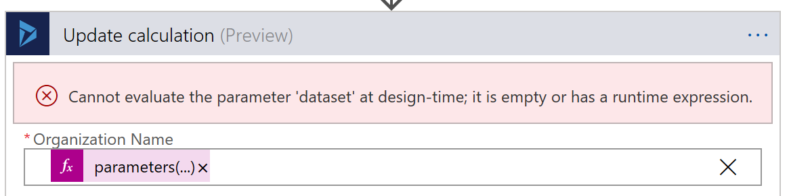

{
  "author": "Sander Schutten",
  "categories": [
    "Serverless",
    "Logic Apps",
    "Visual Studio",
    "Azure",
    "Improvements",
    "Connectors"
  ],
  "date": "2018-02-06T14:00:00Z",
  "description": "",
  "draft": false,
  "slug": "logic-apps-improvement-suggestions",
  "tags": [
    "serverless",
    "logic apps",
    "visual studio",
    "Azure",
    "improvements",
    "connectors"
  ],
  "title": "Logic Apps improvement suggestions",
  "menu": {
    "sidebar": {
      "name": "Logic Apps improvement suggestions",
      "weight": 201802,
      "identifier": "logic-apps-improvement-suggestions",
      "parent": "2018/02"
    }
  }
}

I must say that Logic Apps has come a long way in its brief lifetime. It's surprisingly easy to get up and go with Logic Apps and the number of available connectors is crazy. However there are still a couple of things that could be improved to make it friendlier for the more serious applications. Here's my list.

The last few weeks I had the chance to spend a lot of time with Azure Logic Apps. I've done some logic apps before, but that was about a year ago and a lot has changed. So I was looking forward to what has been changed and what the current state of logic apps is today. Can it rival the reliability and flexibility of BizTalk Server? After all, that's what I, and probably the majority of Microsoft integration specialists, compare it to.

## Designer
The first number of improvement suggestions are regarding the designer experience. The designer has been tweaked quite a bit over time. I still remember one day the layout has changed from horizontal to vertical. It appears the designer has been greatly improved, however there are still a few things that annoy me or could make my life easier.

### Working with input fields is wonky
This annoys me quite a bit, especially because working with input fields is the most frequently performed activity when working on a logic app. When working with input fields, you can type in some static text or pick dynamic content from the fly-out dialog. In general it works, but there are a few flaws that make working with the input fields not a nice experience:

- Selected dynamic content doesn't always show up in the input field. When this happens I have to refocus the field and try again.
- Pressing backspace one time too often makes the browser go back a page. Of course this is only an issue when working in the browser instead of Visual Studio. It would be nice to show a 'You're leaving this page, are you sure' dialog.
- When combining dynamic and static content in a single field, it's difficult to position the cursor.

### Sometimes not all fields visible in dynamic content dialog
This one is also a bit annoying. Sometimes the designer tells me there's no dynamic content available or it isn't showing all fields, even though I'm sure a particular field is there. Most of the times this can be fixed by removing and reapplying the focus of an input field. In a few occasions it's just not working at all and I have to revert to code view.

### Using dynamic content in expressions
A more advanced scenario perhaps is using dynamic content in expressions. The dynamic content dialog has two tabs. The first is for selecting dynamic content that is generated from connectors and actions. The second is for selecting expressions like concat(). Most of the times an expression is used in conjunction with one or more dynamic content properties. It would be nice if a more 'Excel-like' experience is supported where you can type part of an expression, switch to the dynamic content tab and select a property. Or alternatively you get code completion in the expression editor. I've been able to do this once, but it's not a very reliable or repeatable process.

### Select body of previous actions
It's relatively easy to select properties (apart from the few issues I've described above). However it would be nice if we could simply select the body from previous actions as well. Right now we need to type in the expression body(...) manually. At least, that's as far as I know. If there's a better way, please let me know.

### Typing slow in Visual Studio
I've witnessed this a few times when working in Visual Studio. Typing in the action input fields is sometimes terribly slow. I haven't been able to reproduce it reliably, but I do think it has something to do with internet bandwidth, for some reason unknown to me.

### Allow renaming of referenced actions
This is a minor one, but still bugging me a bit. Once triggers or actions have dependencies, like other actions that use the output of the trigger or action, you're unable to rename it any longer. Propertly naming triggers and actions make it easier for others to understand, so it would be nice if we could rename it after the fact. The only solution currently is to switch to code view and find-replace the name of the trigger or action.

### Remember collapse/expand state of actions
When you open the logic app editor or you switch from code view to designer view, all actions will be collapsed, even though you were just working on an action. It would be nice if the designer would remember the collapse/expand state of the actions. This is especially useful if you quickly need to do something in code-view and than come back, not having to expand the actions again to get to the point where you were.

### Recently added actions list
Most of the times I'm working with the same few actions when on a project. Currently when you add a new trigger or action there's a list of most popular connectors and actions, but how great would it be if there was a list of recently used connectors and actions? At least it would save me some time.

Vote for this idea on user voice!
https://feedback.azure.com/forums/287593-logic-apps/suggestions/32690095-in-the-portal-designer-provide-a-recently-added-a

### Don't reload choose an action dialog
A bit in line with the previous suggestion, but it would be nice if the 'Choose an action' dialog wouldn't reload every time. Initially it shows the dialog like I left it, most of the times displaying the connector I need. But then it suddenly refreshes to show the most popular connectors instead. This is slowing down my workflow, since I know I should wait a few seconds for the dialog to refresh and then search again for the connector.

## Continuous Integration/Deployment
The next few improvement suggestions are focused around continous integration and deployment. Although this might be seen as a more advanced topic, these suggestions are at least as important as the previous ones as they allow for a more professional method of working with logic apps which is more in line with other development practices.

### Allow defining parameters in designer
Logic apps support parameters, so we can parameterize pieces of the logic app that change between the different environments we deploy the apps in.

*I've you're new to using parameters to prepare your logic apps for CI/CD, please take a look at [this post](https://blog.kloud.com.au/2017/09/09/mixing-parameters-in-logic-apps-with-arm-template/), so you understand the difference between ARM and logic apps parameters.*

Currently there's no way to view or create logic apps parameters from the designer. The only supported way is by using code-view. This lets you define parameters, but in order to set the parameters from the underlying ARM template, you need to open the json file directly. It would make it a lot easier if we could view and create parameters directly from the designer. Even better would it be if we could set the parameter values to ARM parameters or variables.

Vote for this idea on user voice!
https://feedback.azure.com/forums/287593-logic-apps/suggestions/31818607-allow-adding-parameters-with-a-default-value-on-th

### Some actions don't support parameters
Although parameters are supported, not all actions support parameters well. In runtime I've never seen any problems with parameters, but for some actions it breaks the designer functionality when parameters are used for some input fields. An example is the 'Update a record' action of the Dynamics 365 connector. It is common practice to use separate organizations for each of the staging environments and obviously I'd like to parameterize it. However, when doing this, the designer can't evaluate the 'dataset' parameter. It still works in runtime though, but you lose all designer functionality since the designer can't infer the schema for the record.

### Connections and parameters messed up when opening designer
When I first started out parameterizing my logic apps, I though that the default parameter names were not really descriptful or follow our naming conventions. I started out changing the connections, parameter names and removing unneccessary parameters, only to discover that once I changed something in the logic app, Visual Studio would recreate all connections and parameters. I've got to the point that I accept the situation and that makes my life a bit easier. But it would be nice if the connections and parameters wouldn't get recreated each time we change something in the logic app.

Vote for this idea on user voice!
https://feedback.azure.com/forums/287593-logic-apps/suggestions/31427497-logic-app-designer-and-code-view-update-the-param

